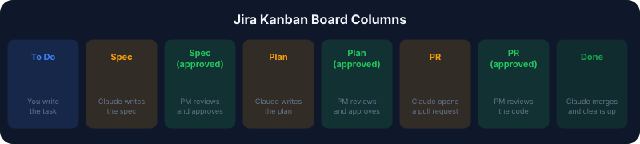

# Automated Dev Workflow: Claude Code + Jira + GitHub Actions

A four-phase CI/CD pipeline that takes a Jira task from idea to merged code — fully automated, with human approval gates at every stage.

Drop a one-liner into Jira. Close your laptop. Come back to a pull request with working code, already formatted, linted, and reviewed.

---

## How it works

The pipeline alternates between **Claude doing work** and **you approving it**. Four automated phases, three human checkpoints.

---

## What you need

| Requirement           | Details                                                                                                       |
| --------------------- | ------------------------------------------------------------------------------------------------------------- |
| **GitHub repo**       | With the [Claude Code GitHub App](https://github.com/apps/claude) installed                                   |
| **Jira Cloud**        | Free tier works. Kanban board with 8 columns (see below)                                                      |
| **Anthropic API key** | With credits loaded. Spec/plan phases cost cents; implementation costs more                                   |
| **Jira API token**    | Generated from your [Atlassian account settings](https://id.atlassian.com/manage-profile/security/api-tokens) |
| **CLAUDE.md**         | A briefing document in your repo root describing your tech stack, code standards, and file structure          |

### GitHub Secrets

Add these in your repo under Settings > Secrets and variables > Actions:

| Secret              | Value                         |
| ------------------- | ----------------------------- |
| `JIRA_BASE_URL`     | Your Jira instance URL        |
| `JIRA_PROJECT_KEY`  | Your project key (e.g. `KAN`) |
| `JIRA_EMAIL`        | Your Jira email               |
| `JIRA_API_TOKEN`    | Your Jira API token           |
| `ANTHROPIC_API_KEY` | Your Anthropic API key        |

---

## Jira board setup

Create a Kanban board with exactly these 8 columns, in order:

The column names must match exactly — the workflows use JQL queries that filter by status name.

---

## The four phases

### Phase 0: Spec Creation

**Workflow:** `jira-spec-tasks.yml` | **Trigger:** Daily at 07:00 UTC (or manual)

1. The GitHub Action triggers and fetches all "To Do" tasks from Jira.
2. For each task, the Claude Code agent starts and reads the spec template.
3. Claude writes a detailed feature specification based on the task summary.
4. The spec is saved to `_specs/` and written to the Jira issue description.
5. Claude sets an effort estimate (story points) and moves the task to "Spec".

**Your turn:** Read the spec in Jira. Edit it if needed. When it looks good, drag it to "Spec (approved)".

---

### Phase 1: Planning

**Workflow:** `jira-plan-tasks.yml` | **Trigger:** Daily at 07:00 UTC (or manual)

1. The GitHub Action triggers and fetches all "Spec (approved)" tasks from Jira.
2. Claude reads the approved spec from the Jira description.
3. Claude analyzes the codebase — reading relevant source files, understanding existing patterns, and identifying dependencies.
4. Claude writes a step-by-step implementation plan with design decisions, file changes, and verification steps.
5. The plan is saved to `_plans/` and written to the Jira description. The task moves to "Plan".

**Your turn:** Review the plan. Does the approach make sense? Drag to "Plan (approved)".

---

### Phase 2: Implementation

**Workflow:** `jira-implement-approved.yml` | **Trigger:** Daily at 07:00 UTC (or manual)

1. The GitHub Action triggers and fetches all "Plan (approved)" tasks from Jira.
2. Claude creates a feature branch (e.g. `claude/feature/KAN-12-card-component`).
3. Claude implements the plan — writing code, creating files, and following the project's code standards from `CLAUDE.md`.
4. Claude runs formatting (`prettier`) and linting (`eslint`) and fixes any issues.
5. The branch is pushed, a pull request is created, and the task moves to "PR".

**Your turn:** Review the pull request. Approve it and drag the task to "PR (approved)".

---

### Phase 3: Merge

**Workflow:** `jira-merge-approved.yml` | **Trigger:** Daily at 07:00 UTC (or manual)

1. The GitHub Action triggers and fetches all "PR (approved)" tasks from Jira.
2. The approved pull request is merged into main.
3. The feature branch is deleted to keep the repo clean.
4. The task is moved to "Done" and a closing comment is added.

---

## System architecture

---

## Helper scripts

Six bash scripts in `scripts/` handle all Jira communication:

---

## The CLAUDE.md file

This is the most important piece. `CLAUDE.md` is Claude's onboarding document — it describes your tech stack, code standards, file structure, naming conventions, and architectural patterns.

The better this file is, the better Claude's output will be. It should cover:

- **Tech stack** — frameworks, libraries, versions
- **Code standards** — formatting, linting rules, function style, error handling patterns
- **Project structure** — where files live, how domains are organized
- **Key patterns** — routing, state management, auth, theming
- **Commands** — how to build, test, lint, format

Claude reads this file before every phase and follows it as its primary guide for making decisions.

---

## Costs

| Phase          | Typical cost | Notes                                                       |
| -------------- | ------------ | ----------------------------------------------------------- |
| Spec creation  | ~$0.02-0.05  | Mostly text generation from a template                      |
| Planning       | ~$0.05-0.15  | Reads several source files to ground the plan               |
| Implementation | ~$0.50-3.00  | Reads/writes many files, runs tools. Varies with complexity |
| Merge          | ~$0.01       | Simple API calls                                            |

Set a daily budget in the Anthropic console. Start with the daily schedule and use manual triggers while testing.

---

## Key insight

This is not about replacing the developer or project manager. It is about making them faster.

- You still review every specification
- You still approve every plan
- You still sign off on every pull request

Claude does the heavy lifting. You make the decisions.
