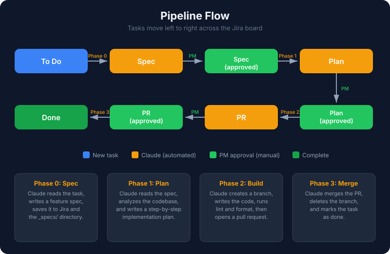
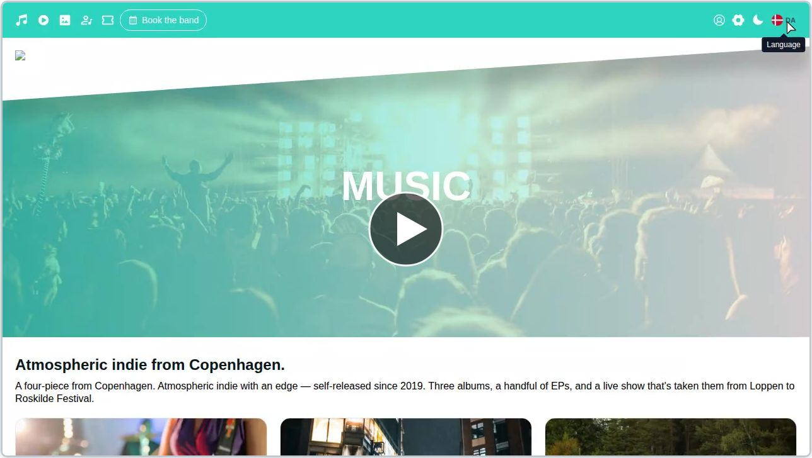
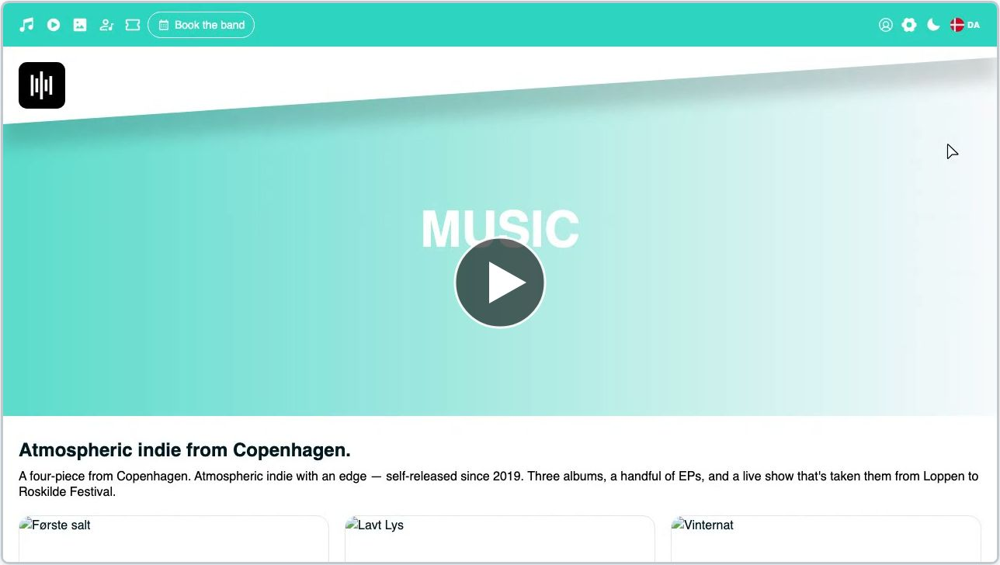

# Bandfolio

- A simple CMS for bands to manage and present their music online.
- A creator-focused music platform built with Vue, TypeScript and Tauri.

This project explores how musicians and creators can present their work online through a modern, user-friendly platform with integrated audio playback, video embeds and content management workflows.

## Why I built it

I wanted to build more than just a personal website. The goal was to create a platform that supports real artist workflows and combines strong frontend architecture with music-focused UX.

The project also gave me space to work with areas I care deeply about:

- music and creator tools
- audio UI and playback experiences
- scalable frontend architecture
- maintainable component systems
- product-oriented development

## Automated Jira workflow

The project uses a four-phase CI/CD pipeline powered by Claude Code and GitHub Actions, connected to a Jira Kanban board. Tasks flow automatically from idea to merged code, with human approval gates at every stage.

Read the full tutorial with diagrams: **[AutomatedWorkflow.md](AutomatedWorkflow.md)**

## Screenshots / Demo

### Site browsing

Click the thumbnail to watch the demo video.

### Album browsing

Click the thumbnail to watch the album browsing and waveform player demo.

### Album creation

Click the thumbnail to watch the album creation demo.

## Tech stack

- Vue 3 + Vite 6
- TypeScript (strict mode)
- Tauri 2 (desktop shell)
- Pinia 3 (+ pinia-plugin-persistedstate)
- PrimeVue 4 + Tailwind CSS
- Supabase (database, auth, storage, edge functions)
- Stripe (payments via Supabase edge functions)
- Resend (transactional email)
- vue-i18n (Danish + English)
- WaveSurfer.js (audio waveforms)
- Vuelidate (form validation)
- Playwright (E2E) + Jest (unit)

## Domain architecture

The codebase is organized by **business domain** rather than technical layer. Each domain owns its own `components/`, `views/`, `stores/`, `lib/` and `composables/`. The sections below describe the features that live inside each domain.

---

### Music domain (`src/music/`)

The core of the platform: everything related to albums, tracks and the audio player.

Features:

- **Album browsing** — `AlbumIndexView` lists all albums, `AlbumDetailView` shows a single album with hero banner, notes and track list.
- **Album management** — `AlbumCreateView` and `AlbumEditView` let admins create and edit albums, including cover art, year, notes and ordered audio files (MP3, AAC, WAV).
- **Waveform-based player** — `player.vue` uses WaveSurfer.js to render a visual waveform with seek, play/pause and track progress.
- **Track list and rows** — `trackList` and `trackRow` components handle per-track playback, duration display and active-track highlighting.
- **Equalizer and volume** — dedicated `equalizer` and `volume` components for fine-grained playback control (volume is persisted across sessions).
- **Global playback state** — the `song` Pinia store keeps the `HTMLAudioElement` as `markRaw`, exposes actions like `playOrPauseThisSong`, `nextSong`, `prevSong`, and `closePlayer` so any view can trigger playback.
- **Album hero and notes** — `albumHero` and `albumNotes` render the release presentation, auto-translating descriptive fields while leaving titles as original creative content.

---

### Booking domain (`src/booking/`)

A full two-stage booking flow for venues who want to book the band, with admin review in the middle.

Features:

- **Interactive booking calendar** — `BookingCalendar.vue` (PrimeVue DatePicker, inline mode) shows Danish holidays with emoji indicators and existing booking markers. Past dates are disabled.
- **Initial booking form** — `BookingCreateView` captures title, time, address, description and a venue image, then charges an administration fee via Stripe in a single flow.
- **Admin review queue** — `BookingAdminView` lists all booking items with status badges and filters. `BookingEditView` is the full detail/edit page with Stripe IDs, approve/reject controls and resend-email buttons.
- **Second-stage payment** — `BookingConfirmView` lets the venue pay for 1–3 concert sets after admin approval; a second Stripe payment ID is stored on the booking item.
- **User-side booking management** — `BookingsView` shows the logged-in user's bookings as cards; `BookingUserEditView` lets them update booking details after submission.
- **Public concert list** — `ConcertsView` displays approved, public bookings as a filterable grid with venue images and ticket links.
- **Danish holidays helper** — `lib/holidays.ts` provides the holiday data used by the calendar.
- **Transactional emails** — four email types (`new_booking`, `booking_received`, `booking_approved`, `booking_confirmed`) sent via the `booking-notification` Supabase Edge Function + Resend.

---

### Content domain (`src/content/`)

Articles, pages and sections — the editorial surface of the site.

Features:

- **Article index and detail** — `ArticleIndexView` lists articles, `article.vue` renders a single article with rich text and image gallery.
- **Article image gallery** — `ArticleImageGallery.vue` supports drag-and-drop upload, native HTML5 drag reordering, click-to-crop via `vue-advanced-cropper`, and a "Cover" badge on the first image. Works in both edit mode (immediate upload) and create mode (queued uploads flushed after row creation).
- **Article CRUD** — `ArticleCreateView` and `ArticleEditView` for authoring, backed by `PageForm`.
- **Page management** — `PageIndexView`, `PageCreateView`, `PageEditView` for dynamic pages made up of reusable sections.
- **Site-wide settings** — `PageInfoEditView` edits brand colors, currency (DKK / EUR / GBP), site metadata and other global configuration applied at runtime via `applyThemeColors()`.
- **Section composition** — `section.vue` is the building block for assembling pages from mixed content types.
- **Page load composable** — `usePageLoad.ts` centralizes page fetching and loading state.
- **Loading skeleton** — `article-skeleton.vue` provides a pulse placeholder while content loads.

---

### Video domain (`src/video/`)

Embedded YouTube videos for releases, live performances and promo content.

Features:

- **Public video grid** — `VideosView` shows all videos in a responsive grid with thumbnails.
- **Video dialog player** — `videoDialog.vue` opens a modal player so videos play in context without leaving the page.
- **Video banner** — `VideoBanner.vue` is a reusable hero/banner component that can feature a video on landing pages.
- **YouTube content management** — `YouTubeIndexView`, `YouTubeCreateView` and `YouTubeEditView` let admins add videos by URL/ID, set titles and ordering.
- **Title preservation** — video titles are treated as original creative content and never auto-translated.

---

### Member domain (`src/member/`)

Band member profiles.

Features:

- **Member listing** — `MemberIndexView` renders the full band with per-member cards.
- **Member component** — `member.vue` displays name, role, photo and bio for a single member.
- **Member CRUD** — `MemberCreateView` and `MemberEditView` for adding and editing members, including image upload to the `member` storage bucket.
- **Translated role and description** — member roles and bios flow through `useAutoTranslate`, while the member's name itself stays untranslated.

---

### Gallery domain (`src/gallery/`)

Photo gallery — promotional images, press photos and media assets.

Features:

- **Gallery list** — `GalleryIndexView` shows all gallery images in an admin table.
- **Gallery CRUD** — `GalleryCreateView` and `GalleryEditView` handle image creation and editing via `PageForm`, with images stored in the `stockimages` bucket.
- **Admin-scoped** — all gallery routes are admin-only and guarded both at the router and component level.

---

### User domain (`src/user/`)

Authentication, user profiles and role-based access.

Features:

- **Login / signup** — `LoginView` handles Supabase email/password auth and OAuth flows.
- **User profile** — `ProfileIndexView` shows the current user's profile, `ProfileEditView` lets them update it.
- **Admin user management** — `UserView` lists all users; `UserUpdateView` lets admins edit roles, approval status and profile fields.
- **Approval workflow** — new users start unapproved; `useUserApproval.ts` and `UiUserApprovalWarning.vue` surface approval state and block gated actions until an admin approves the account.
- **Auth guard composable** — `useAuthGuard.ts` wraps the common "require auth / require role" checks used by views and router guards.
- **Persisted user state** — the `user` Pinia store is the single source of truth for the current user, role and profile; views read via `storeToRefs` and never hit Supabase directly.

---

### Shared (`src/shared/`)

Cross-cutting building blocks used by three or more domains — not a domain itself, but the glue.

- **Grid components** — `albums`, `articles`, `concerts`, `members`, `videos` grids that render domain-specific cards in a consistent layout.
- **Table components** — PrimeVue DataTable wrappers for every admin list (albums, articles, bookings, pages, sections, gallery, video, members, users, activity log).
- **Input components** — `text`, `textarea`, `dropdown`, `file`, `image`, `range`, `year` inputs built on PrimeVue's `FloatLabel` pattern.
- **Layout** — `DefaultLayout`, header, footer, image gallery and page sections.
- **Shared views** — `HomeView`, `AboutUsView`, `TermsView`, `PrivacyView`, `ParallaxView`, `PreviewView` (component dev sandbox), `LogIndexView`, `ImagesView`.
- **Composables** — `useToast`, `useAutoTranslate`, `usePhoneValidation`, `useFormValidation`, `useGooglePlaces`.
- **Lib** — `supabase` clients, `format`, `constants` (source of truth for routes, menus, form schemas), `i18n`, `translate`, `logger`, `validators`, `database.types`, `colors`, `countries`, `pageinfo`, `booking.types`, `notifications`.
- **Stores** — `data` (content cache + activity log) and `theme`.

## Key architectural patterns

- **Danish-first i18n** — Danish routes (`/musik`, `/videoer`) are canonical, English (`/music`, `/videos`) are aliases. `vue-i18n` locale is inferred from the path.
- **Runtime theming** — CSS variables in `style.css` are fallbacks; `applyThemeColors()` overrides them at startup from the database so each site has its own palette.
- **No server routes** — everything talks to Supabase client-side. Three Supabase projects (local, Bandfolio, production) are kept in sync.
- **Stores own the data layer** — views and components never import the Supabase client. Pinia stores encapsulate reads, writes and caching.
- **Constants as single source of truth** — `src/shared/lib/constants.ts` defines pages, menus, form schemas and table mappings consumed by the router, navigation, footer and `PageForm`.
- **Edge functions for sensitive work** — Stripe PaymentIntents, booking emails and Facebook data-deletion callbacks run in Supabase Edge Functions (Deno).
